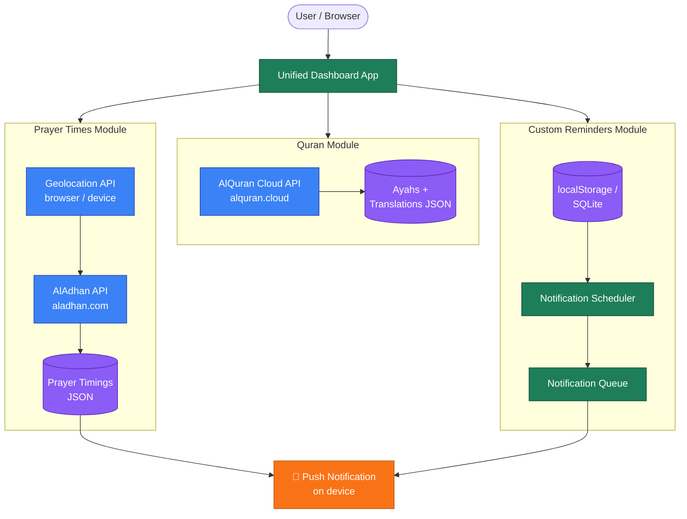
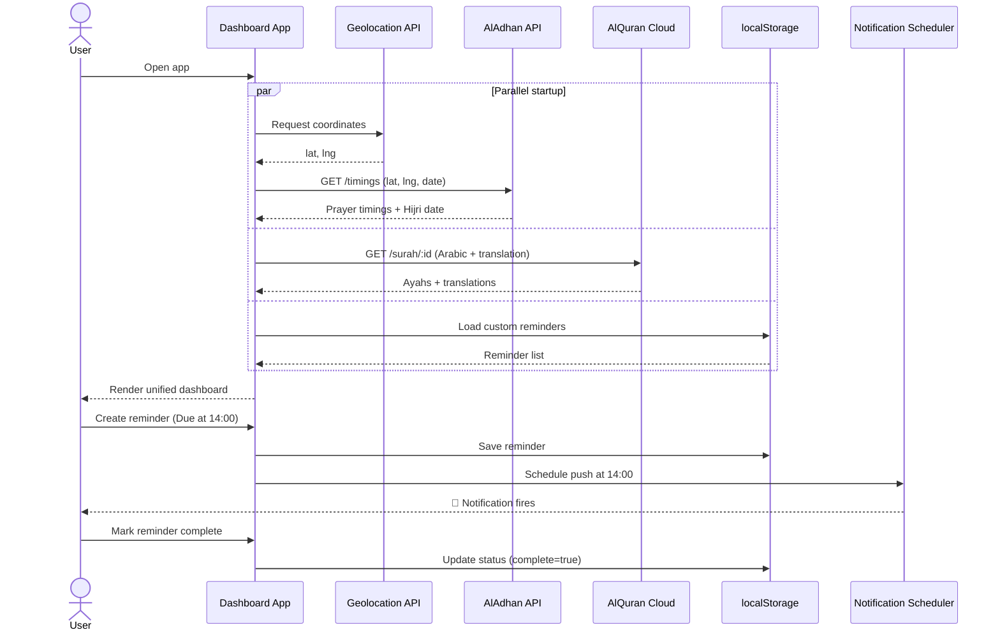

# Islamic Daily Dashboard

A unified Islamic companion app — Quran reader, prayer times, and custom reminders — built as a cross-platform monorepo targeting **Web**, **iOS**, and **Android** from a single TypeScript codebase.

---

## Overview

The Islamic Daily Dashboard brings three essential daily Islamic activities into one clean interface:

- **Quran Reader** — Scrollable ayah-by-ayah reading with Arabic + English translation, auto-save reading position, bookmarks, and progressive pagination
- **Prayer Times** — GPS-based automatic prayer time calculation with 7+ calculation methods, Hijri date display, next-prayer countdown, and scheduled notifications
- **Custom Reminders** — Create personal spiritual reminders (e.g., "Recite Ayat al-Kursi after Dhuhr") with timed push notifications and daily/weekly repeat

All three modules converge on a single dashboard with a shared notification system — offline-capable, privacy-first, and designed for daily use.

---

## Architecture

### System Diagram



### Data Flow



### Tech Stack

| Layer | Technology |
|-------|-----------|
| **Framework** | React Native (Expo SDK 52+) for mobile, Vite + React for web |
| **Language** | TypeScript (strict mode) |
| **Monorepo** | npm workspaces (upgradeable to Turborepo) |
| **Storage** | expo-sqlite (mobile), localStorage (web) — abstracted behind `StorageService` port in `shared/ports/` |
| **Notifications** | expo-notifications (mobile), Web Notification API + setTimeout (web) — abstracted behind `NotificationScheduler` port |
| **Geolocation** | expo-location (mobile), navigator.geolocation (web) — abstracted behind `GeolocationProvider` port |
| **API caching** | In-memory TTL cache in `shared/api/httpClient.ts` + Workbox runtime caching via `vite-plugin-pwa` (web prod) |
| **CI/CD** | GitHub Actions + EAS Build (mobile), Cloudflare Pages (web) |
| **Hosting** | Cloudflare Pages (web PWA) |

### Monorepo Structure

```
islamic-dashboard/
├── packages/
│   ├── shared/                     # ~80% of code — shared across all platforms
│   │   ├── api/                    # Aladhan + AlQuran Cloud API clients + httpClient (caching/timeout)
│   │   ├── models/                 # TypeScript interfaces (Prayer, Surah, Ayah, Reminder)
│   │   ├── hooks/                  # React hooks (useQuran, usePrayerTimes, useReminders, ...)
│   │   ├── ports/                  # Platform-agnostic interfaces: StorageService,
│   │   │                           #   NotificationScheduler, GeolocationProvider
│   │   └── utils/                  # Date helpers, prayer-time parsing, theme tokens
│   ├── mobile/                     # Expo app (iOS + Android) — Phase 4
│   │   └── src/services/           # Port implementations: expo-sqlite / expo-notifications / expo-location
│   └── web/                        # Vite + React PWA
│       ├── src/
│       │   ├── App.tsx             # Shell + <NotificationOrchestrator/>
│       │   ├── NotificationOrchestrator.tsx   # Root-level re-hydration of scheduled notifs
│       │   ├── pages/              # Dashboard, QuranReader, Reminders
│       │   └── services/           # Port implementations: LocalStorageAdapter,
│       │                           #   WebNotificationScheduler, WebGeolocationProvider
│       └── public/                 # PWA manifest, icons
├── package.json                    # Monorepo root (npm workspaces)
└── tsconfig.base.json              # Shared TypeScript config
```

### Platform Boundary (Ports & Adapters)

Platform-specific concerns live behind three interfaces in `packages/shared/src/ports/`. The shared package **never** imports browser or native globals — it only declares the contract. Each platform package owns its adapters:

```
┌─────────────────── packages/shared ───────────────────┐
│ ports/storage.ts         StorageService               │
│ ports/notifications.ts   NotificationScheduler        │
│ ports/geolocation.ts     GeolocationProvider          │
│ hooks/...                depend on StorageService     │
└────────────────────────▲──────────────────────────────┘
                         │ implements
                         │
      ┌──────────────────┼──────────────────┐
      │                                     │
┌─────┴──── packages/web ─────┐   ┌─────────┴──── packages/mobile ─────┐
│ services/localStorageAdapter │   │ services/sqliteAdapter              │
│ services/notifications (web) │   │ services/notifications (expo)       │
│ services/geolocation (web)   │   │ services/geolocation (expo)         │
└──────────────────────────────┘   └─────────────────────────────────────┘
```

### Code Sharing Strategy

~80% of the codebase lives in `packages/shared/` and is consumed identically by all platforms. The remaining ~20% is platform-specific:

| Concern | Shared | Web | Mobile |
|---------|--------|-----|--------|
| API clients (Aladhan, AlQuran) + httpClient cache | Direct import | — | — |
| Data models & types | Direct import | — | — |
| React hooks (business logic) | Direct import | — | — |
| Storage | `StorageService` port | `LocalStorageAdapter` | SQLite adapter (Phase 4) |
| Notifications | `NotificationScheduler` port | `WebNotificationScheduler` (setTimeout + Notification API) | expo-notifications (Phase 4) |
| Geolocation | `GeolocationProvider` port | `WebGeolocationProvider` | expo-location (Phase 4) |
| UI components | — | `<div>` + CSS | `<View>` + StyleSheet |
| Navigation | — | React Router | Expo Router |
| Design tokens (colors, spacing) | JS object in `shared/theme.ts` | CSS variables | StyleSheet |

Platform divergence is handled via `.web.ts` / `.native.ts` / `.ios.ts` / `.android.ts` file extensions, resolved automatically by Vite and Metro respectively.

---

## Features (v1 MVP)

### Quran Reader
- 114-surah dropdown selector with Arabic and English names
- 10-ayah scrollable display with "Load 10 More" progressive pagination
- Arabic text (RTL, Uthmani script) + English Sahih International translation
- **Auto-save reading position** via IntersectionObserver — resumes exactly where you left off
- **Bookmark system** — tap the star on any ayah to save it with an optional label
- Bookmark manager — jump to any saved ayah instantly
- Progress bar showing percentage of surah loaded

### Prayer Times
- **GPS auto-detect** — no manual city entry required (falls back to manual input if denied)
- 7+ calculation methods: ISNA, MWL, Egyptian, Umm Al-Qura, Karachi, Gulf, Diyanet
- Next-prayer highlight with countdown timer
- Hijri date display (weekday, day, month, year AH)
- **Push notifications** at each prayer time — works even when app is closed
- Optional adhan audio clip on notification (30-second limit on iOS)

### Custom Reminders
- Create reminders with title, optional date/time, and repeat (none / daily / weekly)
- Toggle complete/incomplete with visual strikethrough
- **Timed push notifications** — "Remind me to recite Ayat al-Kursi at 2 PM"
- Repeating reminders auto-reschedule after firing
- Sorted by due time (upcoming first)

### Offline & PWA
- **Service worker** caches app shell + last-fetched API data
- Quran text: cache-first (text never changes — once loaded, always available)
- Prayer times: stale-while-revalidate with 6-hour TTL
- PWA manifest for "Add to Home Screen" installation on web
- Offline indicator when serving cached data

---

## External APIs

Both APIs are free, require no authentication, and support CORS.

| API | Purpose | Documentation |
|-----|---------|---------------|
| [Aladhan](https://aladhan.com/prayer-times-api) | Prayer times by city/coordinates, calculation methods, Hijri calendar | `https://api.aladhan.com/v1/` |
| [AlQuran Cloud](https://alquran.cloud/api) | Quran Arabic text, 100+ translations, surah metadata | `https://api.alquran.cloud/v1/` |

---

## Platform Deployment

### Web (PWA)

| Decision | Choice |
|----------|--------|
| Framework | Vite + React (standalone — not Expo Web, to avoid react-native-web overhead) |
| Hosting | Cloudflare Pages — free, unlimited bandwidth, 300+ edge CDN, Worker-ready |
| Offline | Workbox via `vite-plugin-pwa` with `injectManifest` mode |
| Push notifications | Tier 1: in-session scheduling. Tier 2: Cloudflare Worker with VAPID keys for background push |
| Performance target | < 80 KB JS gzipped, < 3s TTI on 3G, Lighthouse >= 90 |
| Install | Chrome: `beforeinstallprompt` banner. Safari/iOS: manual "Add to Home Screen" |

**iOS PWA limitations:** Web Push requires iOS 16.4+, must be installed as PWA first. Storage may be evicted after 7 days of non-use. No background sync.

### Android

| Decision | Choice |
|----------|--------|
| Build system | EAS Build (cloud) — development, preview, and production profiles |
| Notifications | HIGH importance channels, `SCHEDULE_EXACT_ALARM` for Android 12+, battery optimization exemption prompts |
| Storage | expo-sqlite with full relational schema |
| Geolocation | Coarse location only (sufficient for prayer times), pre-permission explanation screen |
| Distribution | Play Store (internal testing track for personal use) or sideload APK |
| CI/CD | GitHub Actions + EAS Build, OTA updates for JS-only changes |

**Android gotchas:** Battery optimization on Xiaomi/Huawei/Samsung can kill background notifications — must prompt user to exempt the app. Android 14+ requires `USE_EXACT_ALARM` for precise prayer time scheduling.

### iOS

| Decision | Choice |
|----------|--------|
| Build system | EAS Build (cloud Mac machines), auto-managed certificates |
| Apple Developer | Paid ($99/yr) — required for notifications, ad hoc builds, App Store |
| Notifications | Time Sensitive interruption level (iOS 15+), 7-day rolling window within 64-notification limit (42 prayers + 22 reminders) |
| Storage | expo-sqlite in Documents directory (automatically backed up to iCloud) |
| Geolocation | "When In Use" only, approximate accuracy accepted |
| Personal install | **EAS internal distribution build** — production-quality, 1-year certificate, no App Store required |
| App Store | No policy issues with Islamic content. Privacy policy required. Disclose location data sent to Aladhan API |

**iOS gotchas:** `setTimeout`-based notifications from the prototype do NOT work on mobile — must use `scheduleNotificationAsync`. iOS only shows the notification permission dialog once — if denied, the user must manually enable in Settings. Critical Alerts require a special Apple entitlement (not pursued for v1).

---

## Running the Prototype

A working single-file prototype (`islamic_dashboard.html`) is included for immediate testing:

```bash
# Clone the repo
git clone https://github.com/nashid-ashraf/islamic-dashboard.git
cd islamic-dashboard

# Serve locally (required for Notification API — browsers block it on file:// URLs)
python3 -m http.server 8080

# Open in browser
open http://localhost:8080/islamic_dashboard.html
```

The prototype demonstrates the core flow: prayer times + Quran reader + custom reminders with browser notifications. It uses the same Aladhan and AlQuran Cloud APIs that the production app will use.

---

## Project Status

| Phase | Status |
|-------|--------|
| Research & API evaluation | Done |
| Architecture & requirements | Done |
| Working HTML prototype | Done |
| Web deployment assessment | Done |
| Android deployment assessment | Done |
| iOS deployment assessment | Done |
| **Phase 1+2** — Monorepo scaffold & shared business logic | Done |
| **Phase 3** — Web app (Vite + React PWA) wired to shared hooks | Done |
| **Phase 3.1** — Accessibility pass + hexagonal ports + API caching + notification re-hydration | Done |
| **Phase 4** — Mobile app (Expo) | Planned |
| **Phase 5** — CI/CD pipelines | Planned |
| Production deployment | Planned |

---

## Documentation

| Document | Description |
|----------|-------------|
| [REQUIREMENTS.md](REQUIREMENTS.md) | Full v1 requirements — 50+ functional requirements across all modules, data models, UI specs, non-functional requirements |
| [ASSESSMENT_WEB.md](ASSESSMENT_WEB.md) | Web deployment deep-dive — Vite vs Expo Web, Workbox caching strategies, Cloudflare Pages hosting, Web Push architecture, CI/CD pipeline, performance budgets |
| [ASSESSMENT_ANDROID.md](ASSESSMENT_ANDROID.md) | Android deployment deep-dive — EAS Build config, notification channels, exact alarm permissions, battery optimization, Play Store submission, sideloading |
| [ASSESSMENT_IOS.md](ASSESSMENT_IOS.md) | iOS deployment deep-dive — EAS Build + certificates, 64-notification limit strategy, App Store guidelines for religious apps, sideloading options, HIG compliance |

---

## Roadmap

### v1 (MVP)
- Enhanced Quran reader with pagination, auto-save, and bookmarks
- GPS-based prayer times with push notifications
- Custom reminders with timed alerts
- Offline support and PWA installation
- Device-local storage only

### v2 (Future)
- Cloud sync with user accounts (Firebase/Supabase) — storage layer is pre-architected for this
- Qibla compass
- Dhikr / Tasbeeh counter
- Hadith of the Day
- Light theme toggle
- Multiple Quran translations
- Audio recitation
- Home screen widgets (iOS/Android)

---

## License

This project is for personal use. Quran text is sourced from [AlQuran Cloud](https://alquran.cloud/) (open-source API). Prayer times are calculated by [Aladhan](https://aladhan.com/) (free public API).
